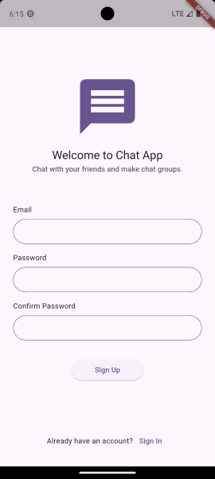

# Chat App Project

A Realtime Chat Application built using Flutter and Firebase with authentication, message persistence, and real-time updates.

> [!IMPORTANT]
> This project is developed by **me** from scratch without copying from any other person's work and without following any tutorial or using AI. I'm ready to challenge anyone to find any project or tutorial similar to mine.

## Features

- [x] Authentication
- [x] Contacts
- [x] Private messaging
- [x] Realtime chat
- [ ] Profile settings
- [ ] Group Chat

## Tech Stack

- Flutter
- Firebase
- Riverpod
- Go Router
- Freezed

## How to use

> [!NOTE]
> You have to have **Firebase CLI** installed to run this project

1. run Firebase Emulator

        npm install
        npm start

2. Run the app in Android emulator (recommened) or the web

## Architecture

This project is based on **MVVM** (Model-View-ViewModel) architecture.

## Screenshots

